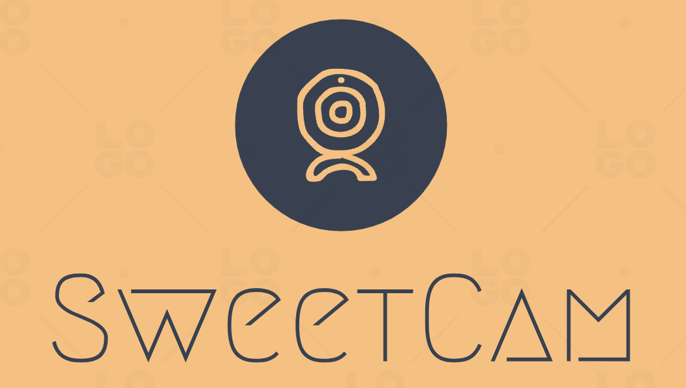

<h1 align="center">
    
</h1>

# Introduction

The application *SweetCam* is a honeypot for IP camera. It can simulate a real IP camera vividly, including the interaction with user for rotating and zooming.

# Components

The SweetCam honeypot application is composed by four parts:

1. The MySQL database service.
2. The RTSP service, this is used to provide the RTSP service for the attackers.
3. The Web service, this is used to provide the web service for the attackers, including viewing the camera page, logging etc.
4. The Cowrie service, this is used as the SSH hoenypot for providing the SSH service for the attackers.


# How to run the application
To run launch the application, just enter the root directory of the application and launch the application with the folloing command:

```shell
docker compose up -d
```

Thereafter, there should be four containers that are running as shown follows:

1. web_service
2. cowrie_service
3. rtsp_service
4. mysql_service

Once launching the four services, there are several configurations should be made within the rtsp_service:

1. Enter the rtsp_service container with the following command:

   ```
   docker exec -it rtsp_service /bin/sh
   ```

2. Revise the mediamtx.yml file to configure the logging function of the Mediamtx application.

# Deploy on cloud
Take Azure Cloud as example.
## Configure SSH
First we need to change the used SSH port since the default one 22 should be used by Cowrie honeypot.
1. sudo vim /etc/ssh/sshd_config.
2. Change the port to another one, 2404 for example.
3. Restart ssh service: sudo service ssh restart
4. Reconnect with new port: ssh -i ./sweetcam_key.pem azureuser@20.107.194.117 -p 2404
5. Revise the virtual machine network policy to allow 2404 traffic.

## Install Docker tool chain
1. sudo apt-get -y update
2. sudo apt-get -y install ca-certificates curl gnupg
3. sudo install -m 0755 -d /etc/apt/keyrings 
4. curl -fsSL https://download.docker.com/linux/ubuntu/gpg | sudo gpg --dearmor -o /etc/apt/keyrings/docker.gpg 
5. sudo chmod a+r /etc/apt/keyrings/docker.gpg
6. echo \
   "deb [arch="$(dpkg --print-architecture)" signed-by=/etc/apt/keyrings/docker.gpg] https://download.docker.com/linux/ubuntu \
   "$(. /etc/os-release && echo "$VERSION_CODENAME")" stable" | \
   sudo tee /etc/apt/sources.list.d/docker.list > /dev/null
7. sudo apt-get update
8. sudo apt-get -y install docker-ce docker-ce-cli containerd.io docker-buildx-plugin docker-compose-plugin

## Deploy application
The procedures are as follows:
1. Revise the virtual machine network policy to allow 80 traffic.
2. git clone https://github.com/Agachily/sweetcam.git
3. Create and populate the .env file 
4. Run the application in the background: `docker compose up -d` (stop with `docker compose down -v`)
5. Try to connect cowrie: ssh -p 22 root@ip_address
6. Enter the container of rtsp service: docker exec -it rtsp_service /bin/sh
7. ffmpeg -re -stream_loop -1 -i fake-video.mp4 -c copy -f rtsp rtsp://localhost:8554/mystream
8. View it at rtsp://20.197.231.249:554/mystream